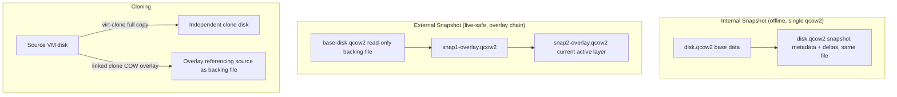

# Snapshots and Cloning

## Overview

Snapshots capture a VM's disk (and optionally memory) state at a point in time so you can roll back after a risky change, while cloning produces an independent copy of a VM for rapid provisioning. Both are managed through [libvirt-and-virsh](libvirt-and-virsh.md) on KVM hosts (`virsh snapshot-*`, `virt-clone`) or through [VirtualBox](VirtualBox.md)'s own snapshot manager, and both are frequently misunderstood as substitutes for real backups — they are not. This note covers internal vs external snapshots, the `virsh snapshot-*` and `virt-clone` workflows, linked clones, and the operational gotchas that trip up admins running production VMs.

> [!IMPORTANT]
> A snapshot is **not a backup**. Snapshots live on the same storage as the VM and depend on the original disk chain — if the underlying storage is destroyed, corrupted, or the base disk is deleted, every snapshot built on it is lost too. Always pair snapshots with off-host backups (`virsh backup-begin`, `rsync`, or a dedicated backup tool) for anything you actually care about.

## Concepts

| Term | Meaning |
|---|---|
| Internal snapshot | Snapshot data stored inside the same qcow2 file as the VM disk (single file, simpler, but frozen in libvirt for online use) |
| External snapshot | New qcow2 overlay file created on top of the base disk; base becomes read-only backing file |
| Live snapshot | Taken while the VM is running, optionally including RAM state |
| Offline snapshot | Taken while the VM is shut off — always safe, always consistent |
| Full clone | Independent copy of the disk image; no dependency on the source VM |
| Linked clone | Copy-on-write overlay referencing the original disk as a read-only backing file; fast, space-efficient, but tied to the parent's lifecycle |
| Snapshot chain | The sequence of overlay files created by successive external snapshots |

Internal snapshots are qcow2-only and, critically, **libvirt no longer supports live internal disk snapshots well** — since QEMU/libvirt deprecated the internal live-snapshot path, `virsh snapshot-create-as` without `--disk-only`/`--live` semantics on a running VM effectively falls back to external snapshots in modern libvirt. In practice: use external snapshots for anything live, and reserve internal snapshots for offline VMs with simple single-file qcow2 disks.

## Architecture



Every external snapshot adds a layer to the chain; reads must potentially traverse every layer back to the base, so long chains degrade I/O performance. This is why `blockcommit`/`blockpull` (flattening the chain) matters operationally, not just snapshot deletion.

## Installation

Snapshot and clone tooling ships with the standard libvirt/QEMU stack — no separate package is usually required, but confirm on Debian-family hosts:

```bash
# RHEL / Rocky / Alma
sudo dnf install -y libvirt libvirt-client virt-install qemu-img

# Debian / Ubuntu
sudo apt install -y libvirt-clients libvirt-daemon-system virtinst qemu-utils
```

`virt-clone` comes from the `virt-install`/`virtinst` package on both families. VirtualBox snapshot support is built into `VBoxManage` and the GUI once VirtualBox itself is installed (see [VirtualBox](VirtualBox.md)).

## Configuration

Before taking snapshots, know your disk format and confirm the domain's disk paths:

```bash
virsh domblklist my-vm
qemu-img info /var/lib/libvirt/images/my-vm.qcow2
```

Snapshots require qcow2 (raw disks cannot hold internal snapshots and need external-overlay-only workflows). Ensure enough free space in the storage pool for overlay growth — a snapshot with no upper bound can fill the pool if the guest writes heavily.

## Commands

### virsh snapshot-* (KVM/libvirt)

```bash
# List existing snapshots for a domain
virsh snapshot-list my-vm

# Create an external, disk-only snapshot while the VM is running (recommended for live VMs)
virsh snapshot-create-as --domain my-vm snap1 \
  --description "before kernel upgrade" \
  --disk-only --atomic

# Create an offline/internal snapshot (VM must be shut off)
virsh shutdown my-vm
virsh snapshot-create-as --domain my-vm snap-offline --description "clean baseline"

# Show snapshot details / XML
virsh snapshot-info my-vm snap1
virsh snapshot-dumpxml my-vm snap1

# Revert to a snapshot
virsh snapshot-revert my-vm snap1 --running

# Delete a snapshot (metadata only — does NOT merge external overlay data automatically)
virsh snapshot-delete my-vm snap1

# Flatten an external snapshot chain back into the base disk (after testing is done)
virsh blockcommit my-vm vda --active --pivot
```

### virt-clone

```bash
# Full independent clone (VM must be shut off)
virt-clone --original my-vm --name my-vm-clone \
  --file /var/lib/libvirt/images/my-vm-clone.qcow2

# Clone with auto-generated storage path and MAC
virt-clone -o my-vm -n my-vm-clone --auto-clone
```

### Linked clones (manual, via qemu-img backing file)

```bash
# Create a COW overlay backed by the (read-only) source disk
qemu-img create -f qcow2 -F qcow2 \
  -b /var/lib/libvirt/images/golden-image.qcow2 \
  /var/lib/libvirt/images/linked-clone.qcow2

# Define a new domain XML pointing its disk at linked-clone.qcow2, then
virsh define linked-clone.xml
```

libvirt has no first-class "linked clone" command like VirtualBox's `--options link`; you build it from a backing-file overlay plus a new domain definition. Treat the golden image as **read-only** — never boot it directly once clones depend on it.

### VirtualBox equivalents

```bash
# Snapshot
VBoxManage snapshot "my-vm" take "before-upgrade" --description "pre-patch state"
VBoxManage snapshot "my-vm" restore "before-upgrade"
VBoxManage snapshot "my-vm" delete "before-upgrade"

# Full clone
VBoxManage clonevm "my-vm" --name "my-vm-clone" --register

# Linked clone
VBoxManage clonevm "my-vm" --name "my-vm-linked" --options link --register
```

## Examples

Typical pre-change safety workflow on a KVM host:

```bash
# 1. Snapshot before a risky config/patch
virsh snapshot-create-as my-vm pre-patch --disk-only --atomic --description "before OpenSSL update"

# 2. Do the risky work inside the guest...

# 3. If it goes well, commit and remove the snapshot layer
virsh blockcommit my-vm vda --active --pivot
virsh snapshot-delete my-vm pre-patch --metadata

# 4. If it goes badly, revert instead
virsh snapshot-revert my-vm pre-patch --running
```

Rapid test-lab provisioning with linked clones (space-efficient, disposable):

```bash
for i in 1 2 3; do
  qemu-img create -f qcow2 -F qcow2 -b golden.qcow2 "lab-node${i}.qcow2"
done
```

## Best Practices

- Prefer **external snapshots** for any VM you might snapshot while running; internal snapshots on live domains are poorly supported in modern libvirt.
- Keep snapshot chains short — flatten with `blockcommit`/`blockpull` promptly after validating a change; long chains hurt I/O and complicate recovery.
- Name and describe snapshots meaningfully (`pre-patch-2026-07-22`, not `snap1`) — `snapshot-list` gives no context otherwise.
- Never delete or move a base/backing-file image while linked clones or snapshot children still reference it.
- Automate periodic pruning: unmanaged snapshot sprawl is one of the most common causes of libvirt hosts running out of storage-pool space.
- Use `qemu-img info --backing-chain` to audit chain depth periodically.

```bash
qemu-img info --backing-chain /var/lib/libvirt/images/my-vm.qcow2
```

## Security Considerations

- Snapshot and overlay files inherit the permissions of the storage pool; verify `libvirt-qemu`/`qemu` ownership and mode (per CIS Distribution Independent Linux Benchmark guidance on restrictive file permissions) so unprivileged users cannot read VM disk contents — snapshots of a VM holding secrets are themselves sensitive data.
- A reverted snapshot can reintroduce previously-patched vulnerabilities or expired credentials — treat `snapshot-revert` as a state change requiring re-validation of patch level, not just functional rollback.
- Golden images used as clone/linked-clone backing files should be hardened and patched **before** cloning; every clone inherits the base's flaws (default passwords, stale SSH host keys — regenerate with `ssh-keygen -A` and delete `/etc/machine-id` post-clone).
- Snapshot metadata and disk overlays are not encrypted by default; if the base disk uses LUKS, ensure overlays don't inadvertently expose the passphrase or unlocked volume state via a memory-inclusive live snapshot.
- Restrict who can invoke `virsh snapshot-revert`/`snapshot-delete` via libvirt's polkit rules (`/etc/polkit-1/rules.d/`) — reverting a production VM is a high-impact, easily-abused action.

> [!NOTE]
> **📸 Screenshot**
> _Capture: `virsh snapshot-list my-vm --tree` output showing a multi-level external snapshot chain, alongside `qemu-img info --backing-chain` for the same disk._

## Troubleshooting

| Symptom | Likely Cause | Fix |
|---|---|---|
| `error: unsupported configuration: internal snapshot for disk ... unsupported` | Attempting internal snapshot on a running VM in modern libvirt | Use `--disk-only` for an external snapshot instead |
| VM won't boot after deleting a snapshot | `snapshot-delete` removed metadata but chain wasn't committed first | Always `blockcommit --pivot` before deleting external snapshot metadata |
| Clone boots with same IP/hostname as original | Both VMs retain the source's network identity and machine-id | Reset with `nmcli`/`dhclient` config, `dpkg-reconfigure openssh-server`/`ssh-keygen -A`, clear `/etc/machine-id` |
| Storage pool full | Unbounded overlay growth from long-lived snapshots on a busy VM | Flatten chains regularly; monitor pool usage; set snapshot retention policy |
| `Failed to lock byte range` errors on revert | Original VM still running or has open locks on backing file | Shut down / undefine dependents before reverting or removing base image |
| Linked clone breaks after base image moved | Backing file path is absolute and no longer resolves | Use `qemu-img rebase` to repoint the overlay, or keep golden images at a fixed, versioned path |

## References

- `man virsh` — see `snapshot-create-as`, `snapshot-revert`, `blockcommit`
- `man virt-clone`
- `man qemu-img` — backing files, `rebase`, `info --backing-chain`
- Libvirt documentation: https://libvirt.org/formatsnapshot.html
- CIS Distribution Independent Linux Benchmark — file permission and access-control guidance applicable to VM disk/storage-pool hardening

## Related Notes

- [libvirt-and-virsh](libvirt-and-virsh.md) — the KVM/libvirt management stack these commands belong to
- [VirtualBox](VirtualBox.md) — GUI/CLI snapshot and clone equivalents for desktop virtualization
- [Linux Administration & Server Hardening](../Readme.md) — course hub and map of content
