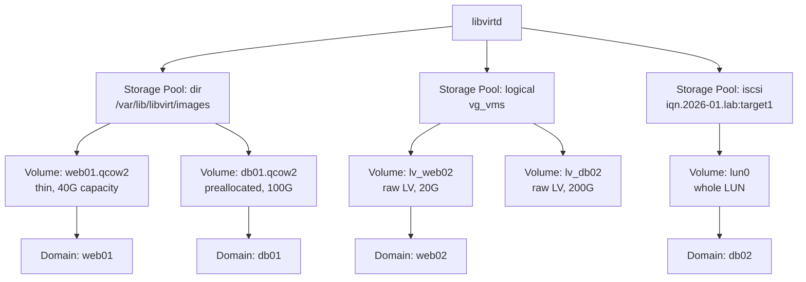

# Storage Pools and Volumes

## Overview

Every VM disk managed by libvirt lives inside a **storage pool** — an abstraction over a directory, LVM volume group, iSCSI target, NFS share, or raw block device — from which individual **storage volumes** are carved out and attached to domains. This layer decouples [QEMU](QEMU.md)'s disk image formats (qcow2, raw) from the underlying host storage technology, letting `virsh` manage capacity, provisioning, and lifecycle the same way regardless of whether the backend is a plain directory or an [LVM](../File-System-and-Disk-Management/Logical-Volume-Manager(LVM).md) volume group. Understanding pool types, volume formats, and thin-provisioning trade-offs is essential for sizing hypervisor hosts and avoiding surprise disk-full outages.

> [!IMPORTANT]
> A thin-provisioned qcow2 volume reports its **logical** (virtual) size to `virsh vol-info`, not its **actual** disk usage. Always monitor the pool's real free space (`virsh pool-info`, `df` on the backing filesystem) — overcommitting thin storage across many guests is a common cause of hosts running out of disk unexpectedly.

## Concepts

| Term | Meaning |
|---|---|
| Storage pool | A managed source of storage capacity (directory, LVM VG, iSCSI LUN, NFS export, ZFS pool, etc.) |
| Storage volume | A single allocatable unit inside a pool — a file, logical volume, or LUN — attached to a domain as a disk |
| Pool state | `active` (started, volumes usable) vs `inactive` (defined but not started) |
| Autostart | Whether a pool starts automatically at `libvirtd` boot |
| Provisioning | `preallocated` (full size reserved up front) vs `sparse`/`thin` (space allocated on demand) |
| Capacity vs Allocation | Capacity = logical/virtual size; Allocation = actual bytes consumed on the backing store |

### Common pool types

| Pool type | Backend | Typical use case | Thin provisioning support |
|---|---|---|---|
| `dir` | Directory on a local/mounted filesystem | Default, simplest — files as volumes | Yes, via qcow2 |
| `fs` | A dedicated formatted partition/disk mounted by libvirt | Similar to `dir` but libvirt owns the mount | Yes, via qcow2 |
| `netfs` | NFS or other network filesystem | Shared storage across hosts, migration support | Yes, via qcow2 |
| `logical` | LVM volume group | Fast raw-block performance, snapshots via LVM | No (raw LVs are fixed-size); thin pools possible with `lvmthin` |
| `iscsi` | iSCSI target (whole LUNs as volumes) | SAN-backed enterprise storage | Depends on SAN |
| `iscsi-direct` | iSCSI without local node session | Same as above, lighter-weight | Depends on SAN |
| `disk` | Whole physical disk with a partition table | Dedicated disk carved into partitions | No |
| `zfs` | ZFS pool/dataset | Snapshots, compression, checksums | Yes, native |
| `rbd` | Ceph RBD pool | Distributed/clustered storage for large deployments | Yes, native |

## Architecture



## Installation

Storage pool management ships with `libvirt-client`/`libvirt-daemon`; ensure the backend-specific packages are present for LVM or iSCSI pools.

```bash
# RHEL/CentOS/Alma/Rocky
sudo dnf install -y libvirt libvirt-client lvm2 iscsi-initiator-utils qemu-img
sudo systemctl enable --now libvirtd iscsid

# Debian/Ubuntu
sudo apt install -y libvirt-daemon-system libvirt-clients lvm2 open-iscsi qemu-utils
sudo systemctl enable --now libvirtd open-iscsi
```

## Configuration

### Creating a `dir` pool (most common default)

```bash
sudo virsh pool-define-as vmpool dir --target /var/lib/libvirt/images/vmpool
sudo virsh pool-build vmpool
sudo virsh pool-start vmpool
sudo virsh pool-autostart vmpool
virsh pool-info vmpool
```

### Creating a `logical` (LVM) pool

Build on top of an existing volume group — see [Logical-Volume-Manager(LVM)](../File-System-and-Disk-Management/Logical-Volume-Manager(LVM).md) for creating the VG/PV first.

```bash
# Assumes vg_vms already exists (pvcreate + vgcreate done)
sudo virsh pool-define-as vg_vms logical --source-name vg_vms --target /dev/vg_vms
sudo virsh pool-start vg_vms
sudo virsh pool-autostart vg_vms
```

### Creating an `iscsi` pool

```bash
sudo virsh pool-define-as iscsi_pool iscsi \
  --source-host 10.10.10.5 \
  --source-dev iqn.2026-01.com.example:storage.target1 \
  --target /dev/disk/by-path
sudo virsh pool-start iscsi_pool
```

### XML definition (reference)

```xml
<pool type='dir'>
  <name>vmpool</name>
  <target>
    <path>/var/lib/libvirt/images/vmpool</path>
    <permissions>
      <mode>0711</mode>
      <owner>0</owner>
      <group>0</group>
    </permissions>
  </target>
</pool>
```

## Commands

### Pool management (`virsh pool-*`)

| Command | Purpose |
|---|---|
| `virsh pool-list --all` | List defined pools and their state |
| `virsh pool-info <pool>` | Show capacity/allocation/available |
| `virsh pool-define <xml>` | Define a pool from XML (not started) |
| `virsh pool-define-as <name> <type> ...` | Define a pool inline without XML |
| `virsh pool-build <pool>` | Physically build the pool (mkfs, mkdir, etc.) |
| `virsh pool-start <pool>` | Activate a defined pool |
| `virsh pool-autostart <pool>` | Enable autostart at libvirtd boot |
| `virsh pool-destroy <pool>` | Stop (deactivate) a pool — does not delete data |
| `virsh pool-undefine <pool>` | Remove pool definition |
| `virsh pool-refresh <pool>` | Rescan pool for volumes added out-of-band |
| `virsh pool-delete <pool>` | Wipe the pool's backing storage (destructive) |
| `virsh pool-edit <pool>` | Edit pool XML in `$EDITOR` |

### Volume management (`virsh vol-*`)

| Command | Purpose |
|---|---|
| `virsh vol-list <pool>` | List volumes in a pool |
| `virsh vol-info <vol> <pool>` | Show volume type, capacity, allocation |
| `virsh vol-create-as <pool> <name> <size> --format qcow2` | Create a new volume |
| `virsh vol-clone <src> <newname> --pool <pool>` | Clone an existing volume |
| `virsh vol-resize <vol> <newsize> --pool <pool>` | Grow (or shrink with `--shrink`) a volume |
| `virsh vol-delete <vol> --pool <pool>` | Delete a volume |
| `virsh vol-wipe <vol> --pool <pool>` | Zero out a volume's contents |
| `virsh vol-dumpxml <vol> --pool <pool>` | Show volume XML |
| `virsh vol-path <vol> --pool <pool>` | Print the volume's backing file/device path |

## Examples

### Create a thin-provisioned qcow2 volume and attach it

```bash
# 40G logical size, allocates space on demand (sparse file)
sudo virsh vol-create-as vmpool web01.qcow2 40G --format qcow2

# Verify: capacity is 40G, allocation starts near 0
virsh vol-info web01.qcow2 --pool vmpool

# Attach as a new disk to a running or shutoff domain
sudo virsh attach-disk web01 \
  /var/lib/libvirt/images/vmpool/web01.qcow2 vdb \
  --targetbus virtio --persistent
```

### Create a preallocated raw LV (fixed-size, best I/O performance)

```bash
sudo virsh vol-create-as vg_vms lv_db02 200G --format raw
virsh vol-path lv_db02 --pool vg_vms
# -> /dev/vg_vms/lv_db02
```

### Convert / inspect image formats with qemu-img

```bash
# Inspect actual vs virtual size of a qcow2 file
qemu-img info /var/lib/libvirt/images/vmpool/web01.qcow2

# Convert raw -> qcow2 (adds thin provisioning + snapshot support)
qemu-img convert -O qcow2 disk.raw disk.qcow2

# Convert qcow2 -> raw (strips snapshots, best for LVM-backed pools)
qemu-img convert -O raw disk.qcow2 disk.raw
```

## Best Practices

- Use **qcow2** on `dir`/`fs`/`netfs` pools when you need internal snapshots, backing files, or compression; use **raw** on `logical`/LVM pools when you need maximum I/O throughput and will rely on LVM snapshots instead.
- Prefer thin provisioning (`qcow2`, sparse) for development/lab environments to conserve disk; use preallocated/raw for production database or latency-sensitive workloads where fragmentation and allocation overhead matter.
- Always check pool free space with `virsh pool-info` before creating new volumes — thin pools can be overcommitted well beyond physical capacity.
- Use `virsh pool-refresh` after manually adding/removing files in a `dir`/`fs` pool so libvirt's volume list stays accurate.
- For multi-host setups (migration, clustering), back pools with shared storage (`netfs`, `iscsi`, `rbd`) rather than local `dir` pools, since VM disks must be reachable from every host that may run the domain.
- Name volumes predictably (`<hostname>.qcow2` or `<hostname>-<disk role>`) to keep large pools auditable.

> [!NOTE]
> **📸 Screenshot**
> _Capture: output of `virsh pool-list --all` followed by `virsh vol-list vmpool` and `virsh vol-info web01.qcow2 --pool vmpool`, showing pool state, autostart, and volume capacity/allocation side by side._

## Security Considerations

- **Permissions**: `dir`-type pool directories should be owned by `root:root` (or the pool's configured owner/group) with mode `0711`; never make VM image directories world-readable, since qcow2 files can leak guest memory/disk contents (CIS-aligned least-privilege on filesystem objects).
- **SELinux/AppArmor**: leave `svirt`/sVirt (SELinux) or AppArmor confinement enabled on libvirt-managed pools — it assigns unique per-VM labels (`svirt_image_t` + a random MCS category) so a compromised QEMU process cannot read another guest's disk. Verify with `ls -Z` on volume files.
- **iSCSI/NFS pools**: authenticate iSCSI sessions with CHAP and restrict NFS exports to the hypervisor host(s) only (`no_root_squash` should generally stay **disabled** unless explicitly required); traffic should ride a dedicated storage VLAN, not the guest network.
- **Volume wiping**: run `virsh vol-wipe` before deleting/repurposing a volume that held sensitive data — deleting the pointer (`vol-delete`) does not zero the underlying blocks, especially on thin-provisioned or LVM-backed storage.
- **Encryption at rest**: for sensitive workloads, use LUKS-encrypted volumes (`qemu-img create -o encrypt.format=luks`) or place pools on a dm-crypt-encrypted block device so a stolen/disposed disk doesn't expose guest data.
- **Resource exhaustion**: cap thin-pool overcommit and monitor with alerting — a full storage pool can hang or corrupt every guest disk on that pool simultaneously (availability = a CIS/NIST control objective too, not just confidentiality).

## Troubleshooting

| Symptom | Likely cause | Fix |
|---|---|---|
| `Pool not found` on `virsh vol-*` | Pool not started or not defined | `virsh pool-list --all`; `virsh pool-start <pool>` |
| Volume created but VM won't boot | Wrong `--format` in disk XML vs actual volume format | Match `<driver type='qcow2'/>` or `raw` to `qemu-img info` output |
| Host disk full despite "plenty of capacity" in `vol-info` | Thin-provisioned volumes overcommitted; `vol-info` shows logical capacity, not allocation | `df -h` on backing filesystem; `qemu-img info` for real allocation; resize/migrate volumes |
| `pool-build` fails with "already exists" | Target directory/device already has data | Use existing pool via `pool-define` + `pool-start` instead of `pool-build`, or choose a new target |
| iSCSI pool won't start | `iscsid` not running, or session not logged in | `systemctl status iscsid`; `iscsiadm -m session`; check CHAP credentials |
| Guest sees stale/incorrect disk size after `vol-resize` | Guest filesystem not yet extended | Grow the guest's partition/filesystem from inside the VM (`growpart`, `resize2fs`/`xfs_growfs`) |
| `virsh vol-list` doesn't show a file you copied in manually | Pool metadata not refreshed | `virsh pool-refresh <pool>` |

## References

- [libvirt Storage Management](https://libvirt.org/storage.html)
- [libvirt Storage Pool XML Format](https://libvirt.org/formatstorage.html)
- `man virsh` — see `pool-*` and `vol-*` command sections
- [QEMU disk image formats (qcow2)](https://www.qemu.org/docs/master/system/images.html)
- CIS Distribution Independent Linux Benchmark — Filesystem permissions and access-control sections
- Red Hat Virtualization Deployment and Administration Guide — Storage Pools chapter

## Related Notes

- [QEMU](QEMU.md)
- [Logical-Volume-Manager(LVM)](../File-System-and-Disk-Management/Logical-Volume-Manager(LVM).md)
- [Linux Administration & Server Hardening](../Readme.md) — course hub and map of content
