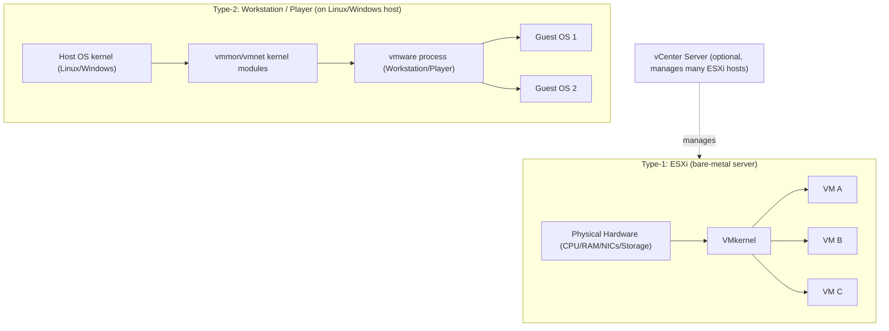

# VMware Workstation and ESXi

## Overview

VMware ships two very different products under one brand: **Workstation Pro/Player**, a type-2 hosted hypervisor that runs as an application on top of Linux or Windows, and **ESXi**, a type-1 bare-metal hypervisor that *is* the operating system on the physical server. Both use the same `.vmx`/`.vmdk` virtual machine file formats and the same guest-integration layer (`open-vm-tools`), but they target completely different use cases — a sysadmin's or pentester's lab machine versus a production datacenter host. This note covers installation and configuration of both, the anatomy of a VM's files, guest tooling, and how VMware stacks up against [VirtualBox](VirtualBox.md) and KVM/libvirt for Linux admin work. See [Introduction-to-Virtualization](Introduction-to-Virtualization.md) for the type-1/type-2 background this note assumes.

> [!IMPORTANT]
> ESXi is licensed, enterprise-grade bare-metal virtualization — it has no underlying general-purpose OS shell to harden, patch, or `ssh` into casually; almost all "server hardening" for it happens through vSphere/host profiles, not `/etc`. Workstation, by contrast, runs as a privileged application on a normal Linux host and inherits that host's attack surface — hardening the *host OS* matters as much as hardening the VM.

## Concepts

| Term | Meaning |
|---|---|
| **Type-1 (bare-metal)** | Hypervisor runs directly on hardware with no host OS underneath (ESXi). |
| **Type-2 (hosted)** | Hypervisor runs as a process/kernel module on top of a general-purpose OS (Workstation, Player, VirtualBox). |
| **VMkernel** | ESXi's own proprietary POSIX-like kernel; not Linux, though it shares some tooling conventions. |
| **vSphere / vCenter** | Management plane for fleets of ESXi hosts (clustering, vMotion, DRS, HA). Not required to run a single standalone ESXi host. |
| **VMFS** | VMware's clustered filesystem for datastores on ESXi, allowing multiple hosts to share storage safely. |
| **open-vm-tools** | Open-source, distro-packaged reimplementation of VMware Tools — clock sync, graceful shutdown, shared folders, better mouse/display drivers, guest IP reporting. |
| **VMX file** | Plain-text key/value config file describing one VM's hardware (CPU, RAM, disks, NICs, boot order). |

## Architecture



## Installation

### Workstation Pro on a Debian/Ubuntu host

```bash
# Download the .bundle installer from VMware (Broadcom) support portal, then:
sudo apt update
sudo apt install -y build-essential linux-headers-$(uname -r) gcc

sudo sh VMware-Workstation-Full-17.6.x-xxxxxxx.x86_64.bundle
sudo vmware-modconfig --console --install-all   # rebuild vmmon/vmnet if a kernel update breaks them
```

### Workstation Pro on an RHEL/Fedora host

```bash
sudo dnf install -y kernel-devel-$(uname -r) gcc make
sudo sh VMware-Workstation-Full-17.6.x-xxxxxxx.x86_64.bundle
```

> [!NOTE]
> As of Workstation 17.5+, VMware Workstation Pro and Fusion Pro are **free for personal use**; commercial use still requires a license/subscription. Player has been folded into Pro.

### ESXi bare-metal install

1. Download the ESXi installer ISO from Broadcom's support portal (requires an account/entitlement).
2. Burn to USB (`dd`, Rufus, or Ventoy) and boot the target server from it.
3. Follow the text installer: select install disk, set the root password, confirm partitioning (ESXi keeps its own boot banks + a VMFS datastore on remaining space).
4. On first boot, the **DCUI** (Direct Console User Interface) shows the management IP — reach the **ESXi Host Client** at `https://<esxi-ip>/ui`.

```bash
# From a Linux jump box, verify the host is reachable and check its build:
curl -sk https://<esxi-ip>/mob/ | head -5

# SSH to ESXi (must be enabled in Troubleshooting Options on the DCUI, or via esxcli remotely):
ssh root@<esxi-ip>
esxcli system version get
```

## Configuration

### The `.vmx` file

Every VM (Workstation *and* ESXi) is described by a plain-text `.vmx` file living alongside its `.vmdk` disks:

```ini
.encoding = "UTF-8"
config.version = "8"
virtualHW.version = "21"
displayName = "debian12-lab"
guestOS = "debian12-64"
numvcpus = "2"
memsize = "4096"
scsi0.virtualDev = "pvscsi"
scsi0:0.fileName = "debian12-lab.vmdk"
ethernet0.virtualDev = "vmxnet3"
ethernet0.networkName = "NAT"
ethernet0.present = "TRUE"
tools.syncTime = "TRUE"
firmware = "efi"
```

Key fields worth knowing when hand-editing or scripting VM builds:

| Field | Purpose |
|---|---|
| `numvcpus` / `memsize` | vCPU count and RAM (MB) |
| `scsi0.virtualDev` | Storage controller — `pvscsi` (paravirtual, best perf) vs `lsilogic` (broad guest compatibility) |
| `ethernet0.virtualDev` | NIC — `vmxnet3` (paravirtual, preferred) vs `e1000e` (legacy compatibility) |
| `ethernet0.networkName` | `NAT`, `Bridged`, `Host-only`, or a named vSwitch/port group on ESXi |
| `firmware` | `bios` or `efi` — must match the guest install media |
| `tools.syncTime` | Whether VMware Tools syncs guest clock to host |

```bash
# Clone a VM by copying its directory and re-registering with a fresh UUID/MAC:
cp -r debian12-lab/ debian12-lab-clone/
cd debian12-lab-clone/
vmware-vdiskmanager -R debian12-lab.vmdk    # optional: repair/rename disk
vmx-file: remove uuid.bios / uuid.location lines so VMware regenerates them on next boot
```

### Installing open-vm-tools inside the guest (Linux)

```bash
# Debian/Ubuntu guest
sudo apt update
sudo apt install -y open-vm-tools open-vm-tools-desktop   # -desktop only if a GUI is present

# RHEL/Fedora guest (open-vm-tools is in the default repos since RHEL 8/Fedora)
sudo dnf install -y open-vm-tools open-vm-tools-desktop

sudo systemctl enable --now vmtoolsd
systemctl status vmtoolsd
```

> [!TIP]
> Never install the legacy binary "VMware Tools" (`VMwareTools-x.y.z.tar.gz` self-installer) on a modern Linux guest — it fights with the distro's own kernel module packaging on every kernel update. `open-vm-tools` from the distro repo is the maintained, upgrade-safe path and is what Red Hat/Canonical/VMware itself now recommend.

### Networking modes (Workstation/Player)

| Mode | Guest gets | Typical use |
|---|---|---|
| **NAT** | Private IP behind host's NAT (`vmnet8`) | Default; guest can reach internet, host can't reach guest without port-forward |
| **Bridged** | IP on the same LAN as the host (`vmnet0`) | Guest needs to be a first-class LAN citizen (servers, pentest targets) |
| **Host-only** | Private network shared only with the host (`vmnet1`) | Isolated lab segments, air-gapped test networks |
| **Custom vSwitch (ESXi)** | Attached to an ESXi virtual switch / port group, optionally VLAN-tagged | Production segmentation, multiple isolated lab VLANs on one host |

## Commands

```bash
# --- Workstation / vmrun (host side) ---
vmrun list                                   # running VMs
vmrun start "/path/to/debian12-lab.vmx" nogui
vmrun stop "/path/to/debian12-lab.vmx" soft  # graceful ACPI shutdown (needs Tools)
vmrun snapshot "/path/to/debian12-lab.vmx" "clean-install"
vmrun revertToSnapshot "/path/to/debian12-lab.vmx" "clean-install"
vmrun getGuestIPAddress "/path/to/debian12-lab.vmx"

# --- ESXi / esxcli & vim-cmd (host side, via SSH) ---
esxcli vm process list                       # running VMs and world IDs
esxcli network ip interface list             # vmkernel NICs
esxcli storage filesystem list               # datastores
vim-cmd vmsvc/getallvms                      # list registered VMs
vim-cmd vmsvc/power.on <vmid>
vim-cmd vmsvc/power.shutdown <vmid>
vim-cmd vmsvc/snapshot.create <vmid> "pre-patch"

# --- Guest side (Linux VM with open-vm-tools) ---
vmware-toolbox-cmd stat raw text session     # confirm Tools sees the hypervisor
vmware-toolbox-cmd timesync status
vmware-toolbox-cmd disk shrink /              # reclaim thin-provisioned space
```

## Examples

**Scripted lab VM creation with `vmrun`** (Workstation, Linux host):

```bash
vmrun -T ws clone \
  "/vms/templates/debian12-base.vmx" \
  "/vms/lab/debian12-lab01.vmx" \
  linked -snapshot="baseline" \
  -cloneName="debian12-lab01"

vmrun -T ws start "/vms/lab/debian12-lab01.vmx" nogui
```

**Bulk power operations across an ESXi host** (bash + `vim-cmd` over SSH):

```bash
for vmid in $(vim-cmd vmsvc/getallvms | awk 'NR>1{print $1}'); do
  vim-cmd vmsvc/power.getstate "$vmid"
done
```

> [!NOTE]
> **📸 Screenshot**
> _Capture: the ESXi Host Client (`https://<esxi-ip>/ui`) Virtual Machines tab showing a VM's summary panel with CPU/memory/network utilization graphs, to illustrate what host-level monitoring looks like without vCenter._

## Best Practices

- Keep VM disks **thin-provisioned** during lab/dev use to conserve datastore space; convert to thick-provisioned (`eagerzeroedthick`) only for production I/O-sensitive workloads.
- Use **snapshots as short-lived checkpoints**, not backups — a snapshot chain left running for weeks bloats storage and tanks disk performance on both Workstation and ESXi.
- Prefer **paravirtual devices** (`vmxnet3`, `pvscsi`) over emulated legacy ones (`e1000e`, `lsilogic`) for any guest whose OS ships the drivers — real throughput and CPU savings.
- On ESXi, enable **lockdown mode** and disable the ESXi Shell/SSH except during active troubleshooting; re-disable them afterward.
- Version-control your `.vmx` templates (strip `uuid.*` lines) so lab environments are reproducible, similar to how you'd template a `Vagrantfile` or `virt-install` command.

## Security Considerations

- **CIS ESXi Benchmark** baseline items to check: SSH and ESXi Shell disabled by default, lockdown mode enabled, NTP configured, `.vmx` `isolation.tools.*` settings hardened (disable clipboard/drag-drop between guest and host to reduce VM-escape blast radius via shared clipboard), and syslog forwarded to a remote collector.
- Disable **guest-to-host clipboard and drag-and-drop** (`isolation.tools.copy.disable = "TRUE"`, `isolation.tools.paste.disable = "TRUE"`, `isolation.tools.dnd.disable = "TRUE"`) on any VM that isolates untrusted/malware analysis workloads — these channels have been abused in real VM-escape research.
- Treat the ESXi root account like domain-admin: use unique, rotated credentials, integrate with **Active Directory/vSphere SSO** for named accounts where possible instead of shared root logins, and audit `/var/log/hostd.log` / `/var/log/auth.log` for login activity.
- Workstation runs with elevated privileges on the host via `vmmon`/`vmnet` kernel modules — keep the host OS patched; a Workstation guest-escape CVE is effectively a host-kernel-level compromise.
- Never expose the ESXi management interface (port 443/902) directly to the internet; put it behind a management VLAN/jump host, consistent with segmentation principles covered in the broader hardening course.
- Rotate and scope any API tokens or automation credentials used by scripts calling `esxcli`/`vim-cmd`/PowerCLI remotely — treat them as production secrets, not lab conveniences.

## Troubleshooting

| Symptom | Likely cause | Fix |
|---|---|---|
| Workstation VM won't start after kernel update | `vmmon`/`vmnet` modules not rebuilt for new kernel | `sudo vmware-modconfig --console --install-all` |
| Guest IP not shown in `vmrun getGuestIPAddress` | `open-vm-tools`/`vmtoolsd` not running in guest | `sudo systemctl enable --now vmtoolsd` |
| ESXi host shows "Lost network connectivity" on a vmnic | Physical NIC driver/firmware mismatch or flapping uplink | `esxcli network nic list`; check `esxcli network nic get -n vmnicX` for link state |
| Can't SSH to ESXi | SSH service disabled (default hardened state) | Enable via DCUI *Troubleshooting Options → Enable SSH*, or `vim-cmd hostsvc/enable_ssh` |
| VM disk full despite thin provisioning showing space | Snapshot chain has grown unbounded | Consolidate/delete old snapshots: `vim-cmd vmsvc/snapshot.removeall <vmid>` |
| Clock drift inside guest | Tools time sync disabled or NTP fighting with `tools.syncTime` | Pick one: either `tools.syncTime = "TRUE"` in `.vmx`, or run `chronyd`/`ntpd` in-guest — not both |

## References

- VMware/Broadcom Workstation Pro Documentation — https://docs.vmware.com/en/VMware-Workstation-Pro/
- VMware/Broadcom ESXi Documentation — https://docs.vmware.com/en/VMware-vSphere/index.html
- `open-vm-tools` upstream project — https://github.com/vmware/open-vm-tools
- CIS VMware ESXi Benchmark — https://www.cisecurity.org/benchmark/vmware
- `man vmrun`, `esxcli` command reference (built into ESXi: `esxcli --help`)

## Related Notes

- [VirtualBox](VirtualBox.md) — the free type-2 alternative for local labs
- [Introduction-to-Virtualization](Introduction-to-Virtualization.md) — type-1 vs type-2 fundamentals this note builds on
- [Linux Administration & Server Hardening](../Readme.md) — course hub and map of content
