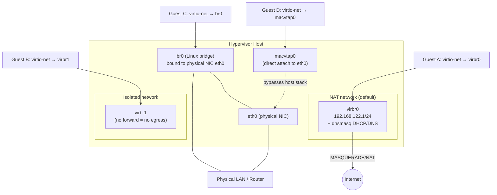

# Virtual Networking in libvirt

## Overview

libvirt gives every KVM/QEMU guest a network identity through one of a handful of connection models — NAT, bridged, isolated, or direct device assignment — each with different tradeoffs between guest reachability, host isolation, and performance. Getting this right matters as much as the compute and storage layers covered in [libvirt-and-virsh](libvirt-and-virsh.md), and it builds directly on host-level bridge and interface concepts from [Linux-Network-Configuration](../Network-Configuration/Linux-Network-Configuration.md). This note walks through the default NAT network, a manually built Linux bridge (`br0`) for full LAN exposure, isolated/internal networks for lab segmentation, the `virsh net-*` command family, and the two paravirtualized/direct data-path options — `virtio-net` and `macvtap`.

> [!IMPORTANT]
> A libvirt "virtual network" (managed by `virtual network switch` / `dnsmasq`) and a "bridged" host interface are architecturally different things. NAT and isolated networks are libvirt-managed `virbr*` bridges with built-in DHCP/DNS; a bridged setup (`br0`) is a plain kernel bridge you build yourself that guests attach to directly, with no libvirt-provided DHCP. Confusing the two is the most common cause of "my VM has no IP" support requests.

## Concepts

| Model | Guest gets an IP from | Guest reachable from LAN? | Host acts as router/NAT? | Typical use |
|---|---|---|---|---|
| **NAT (default)** | libvirt's `dnsmasq` on `virbr0` | No (outbound only, unless port-forwarded) | Yes (iptables/nftables MASQUERADE) | Dev/test VMs needing internet egress only |
| **Bridged (`br0`)** | External LAN DHCP server | Yes, full peer on the LAN | No | Servers, lab VMs that need to be addressed directly |
| **Isolated/Internal** | libvirt `dnsmasq` (optional) or static | No — not even to host's external network | No | Air-gapped labs, malware analysis, multi-tier test topologies |
| **macvtap (direct)** | External LAN DHCP server | Yes, but host cannot talk to guest over that link | No | High-throughput direct attach, no host-guest chat needed |

- **`virbr0`** — the default virtual bridge libvirt creates for the `default` network (typically `192.168.122.0/24`), with `dnsmasq` providing DHCP/DNS and `iptables`/`nftables` rules providing NAT.
- **Isolated network** — a libvirt network with no `<forward>` element at all; guests on it can talk to each other (and optionally the host) but have no path outward.
- **Bridged network** — a standard Linux kernel bridge (`br0`) that owns the host's physical NIC; guests attach a `tap` interface into it and appear as ordinary hosts on the physical LAN.
- **macvtap** — a device driver that lets a guest's virtual NIC attach directly to a physical interface using a MAC-VLAN sub-interface, bypassing the host bridge/kernel networking stack (except for the case of the guest talking to the host itself, which VEPA/private modes block).
- **virtio-net** — the paravirtualized NIC driver; the guest kernel talks to a virtio ring buffer instead of emulating real hardware (e1000, rtl8139), giving near-native throughput with far lower CPU overhead.



## Architecture

libvirt implements NAT and isolated networks as **virtual network switches**: a Linux bridge device (`virbr0`, `virbr1`, …) with no physical NIC attached, a `dnsmasq` instance bound to it for DHCP/DNS, and (for NAT networks only) firewall rules that masquerade guest traffic out the host's default route. Bridged networking skips libvirt's network abstraction entirely — you configure `br0` at the OS network-manager level and libvirt just plugs guest `tap` devices into it, so the guest is layer-2 adjacent to your physical LAN and picks up an address from *your* infrastructure's DHCP, not libvirt's.

macvtap sits between these two models: it gives the guest a private MAC-VLAN endpoint bound straight to the physical NIC (or to a bridge), avoiding the extra bridge hop and its associated overhead, at the cost of losing host↔guest connectivity in the default (`vepa`/`bridge`) modes — the host and the macvtap guest are on the same wire but the kernel deliberately won't forward between the physical interface and a macvtap device sharing its MAC-VLAN parent.

## Installation

```bash
# RHEL/CentOS/Fedora
sudo dnf install -y libvirt libvirt-daemon-driver-network dnsmasq bridge-utils virt-install

# Debian/Ubuntu
sudo apt install -y libvirt-daemon-system libvirt-clients dnsmasq-base bridge-utils virtinst

# Verify the daemon and default network are up
sudo systemctl enable --now libvirtd
sudo virsh net-list --all
```

## Configuration

### 1. Default NAT network

Ships enabled on most installs. Its XML definition (`virsh net-dumpxml default`) looks like:

```xml
<network>
  <name>default</name>
  <bridge name="virbr0" stp="on" delay="0"/>
  <forward mode="nat">
    <nat>
      <port start="1024" end="65535"/>
    </nat>
  </forward>
  <ip address="192.168.122.1" netmask="255.255.255.0">
    <dhcp>
      <range start="192.168.122.2" end="192.168.122.254"/>
    </dhcp>
  </ip>
</network>
```

Attach a guest interface to it via a domain XML snippet or `virt-install --network network=default,model=virtio`.

### 2. Bridged network (`br0` on a physical NIC)

Bridged mode is configured at the host networking layer, not in libvirt. Using `netplan` (Ubuntu) or `NetworkManager` (RHEL family):

```yaml
# /etc/netplan/01-br0.yaml (Debian/Ubuntu, netplan)
network:
  version: 2
  ethernets:
    eth0:
      dhcp4: false
  bridges:
    br0:
      interfaces: [eth0]
      dhcp4: true
      parameters:
        stp: true
        forward-delay: 4
```

```bash
sudo netplan apply

# RHEL family via nmcli
sudo nmcli connection add type bridge ifname br0 con-name br0
sudo nmcli connection add type ethernet ifname eth0 master br0 con-name br0-slave
sudo nmcli connection modify br0 ipv4.method auto
sudo nmcli connection up br0
```

Then define it as a libvirt network of type `bridge` so `virt-manager`/`virt-install` can reference it by name:

```xml
<!-- br0-net.xml -->
<network>
  <name>br0-net</name>
  <forward mode="bridge"/>
  <bridge name="br0"/>
</network>
```

```bash
sudo virsh net-define br0-net.xml
sudo virsh net-start br0-net
sudo virsh net-autostart br0-net
```

### 3. Isolated network

```xml
<!-- isolated-net.xml -->
<network>
  <name>isolated</name>
  <bridge name="virbr2" stp="on" delay="0"/>
  <ip address="192.168.100.1" netmask="255.255.255.0">
    <dhcp>
      <range start="192.168.100.2" end="192.168.100.254"/>
    </dhcp>
  </ip>
  <!-- No <forward> element = no route out of this network -->
</network>
```

```bash
sudo virsh net-define isolated-net.xml
sudo virsh net-start isolated
sudo virsh net-autostart isolated
```

## Commands

| Command | Purpose |
|---|---|
| `virsh net-list --all` | List all defined networks, active or not |
| `virsh net-info <net>` | Show bridge name, autostart, active state |
| `virsh net-dumpxml <net>` | Print full XML config of a network |
| `virsh net-define <file.xml>` | Register a network definition (inactive) |
| `virsh net-start <net>` | Activate a defined network |
| `virsh net-destroy <net>` | Stop an active network (keeps definition) |
| `virsh net-undefine <net>` | Permanently remove a network definition |
| `virsh net-autostart <net>` | Start network automatically on libvirtd boot |
| `virsh net-edit <net>` | Open the network XML in `$EDITOR` for live edits |
| `virsh net-update <net> add/delete ...` | Hot-patch a running network's XML (e.g., add a DHCP host) |
| `virsh domiflist <domain>` | Show a guest's attached interfaces, MACs, and source networks |
| `virsh attach-interface <domain> network default --model virtio --live --config` | Hot-attach a NIC to a running guest |

## Examples

```bash
# Attach a new guest to the default NAT network with virtio-net
virt-install --name test-vm --network network=default,model=virtio ...

# Attach a guest directly to the bridged network created above
virt-install --name web01 --network network=br0-net,model=virtio ...

# Attach via macvtap in bridge mode (no host<->guest traffic)
virt-install --name appliance01 \
  --network type=direct,source=eth0,source_mode=bridge,model=virtio ...

# Equivalent macvtap interface XML for an existing domain
cat <<'EOF' >> macvtap-iface.xml
<interface type='direct'>
  <source dev='eth0' mode='bridge'/>
  <model type='virtio'/>
</interface>
EOF
virsh attach-device web01 macvtap-iface.xml --live --config

# Reserve a static DHCP lease on the default network
sudo virsh net-update default add ip-dhcp-host \
  "<host mac='52:54:00:aa:bb:cc' ip='192.168.122.50'/>" --live --config

# Add a port-forward rule so a NAT-networked guest is reachable on host:2222 -> guest:22
sudo firewall-cmd --add-forward-port=port=2222:proto=tcp:toport=22:toaddr=192.168.122.50 --permanent
sudo firewall-cmd --reload
# Debian/ufw equivalent uses `iptables`/`nft` DNAT rules directly (ufw has no native --forward-port flag)
```

> [!NOTE]
> **📸 Screenshot**
> _Capture: `virt-manager` → guest → **NIC hardware details** pane showing the network source dropdown (Virtual network 'default' / Bridge br0 / macvtap) and the device model set to virtio, side by side with `virsh domiflist <domain>` output in a terminal._

## Best Practices

- Default to **virtio-net** for the NIC model unless the guest OS lacks virtio drivers (very old Windows/legacy Unix) — emulated e1000/rtl8139 costs real CPU and throughput.
- Use **NAT** for disposable dev/test VMs that only need outbound internet; use **bridged `br0`** for anything that needs to be a first-class LAN citizen (file servers, DNS, DHCP, anything other hosts must reach by a stable LAN IP).
- Reserve **isolated networks** for lab segmentation (e.g., a vulnerable-app tier with no egress) — verify with `virsh net-dumpxml` that there truly is no `<forward>` element before trusting the isolation.
- Prefer **macvtap in `bridge` mode** over a host `br0` when you need near-native NIC throughput and don't need the host itself to talk to those guests — it avoids the extra bridging hop.
- Pin static leases with `virsh net-update ... add ip-dhcp-host` instead of hand-editing `/var/lib/libvirt/dnsmasq/*.conf`, which libvirt will overwrite.
- Always pass both `--live` and `--config` to `net-update`/`attach-interface` when a change should survive a libvirtd restart, not just apply to the running instance.

## Security Considerations

- **NAT networks are not a security boundary by themselves** — guests on the same `virbr0` can freely reach each other unless you add explicit `nwfilter` rules or per-guest firewalling; don't rely on NAT alone to isolate mutually-untrusted VMs (CIS virtualization guidance treats "network segmentation between trust zones" as a control, not an assumption).
- Apply **libvirt `nwfilter`** rule sets (`virsh nwfilter-list`, e.g. `clean-traffic`) to guest interfaces to block MAC/IP spoofing and ARP poisoning between VMs on a shared bridge.
- Bridged `br0` puts guests directly on the physical LAN with no host-side packet filtering by default — put guest-facing firewall rules on the guest itself, and consider `ebtables`/`nftables` bridge rules on the host if you need to police L2 traffic between bridge members.
- **macvtap** guests bypass the host's iptables/nftables `FORWARD` chain entirely for that interface (traffic goes straight to the physical NIC's MAC-VLAN layer) — if your security model depends on host-level firewalling of guest traffic, macvtap silently defeats it; use a bridge with `ebtables`/`nftables` hooks instead when that inspection is required.
- Restrict who can define/modify networks: libvirt XML changes require membership in the `libvirt` group or root — treat that group membership as equivalent to local root on the hypervisor (CIS: minimize administrative group membership).
- Disable networks you don't use (`virsh net-destroy` + `net-undefine` for the stock `default` network on hardened hypervisors that only run bridged workloads) to shrink the attack surface of the host's `dnsmasq` process.

## Troubleshooting

```bash
# Guest has no IP at all on a libvirt-managed network
virsh net-list --all              # is the network active?
ip addr show virbr0               # does the bridge have an IP?
sudo journalctl -u libvirtd -f    # watch for dnsmasq/network errors
sudo ss -lunp | grep dnsmasq      # confirm dnsmasq is listening

# Guest on br0 gets no DHCP lease from the LAN
bridge link show                  # is the guest tap interface a member of br0?
ip link show br0                  # is br0 itself UP and has no IP conflict with eth0?
sudo tcpdump -i br0 -n port 67 or port 68   # watch DHCP broadcast/replies on the bridge

# NAT guest can't reach the internet
sudo iptables -t nat -L -n -v | grep MASQUERADE   # or: sudo nft list ruleset
sysctl net.ipv4.ip_forward         # must be 1 on the host

# macvtap guest can't reach the host (expected in bridge/vepa mode)
# Confirm this is by design, not a bug: bridge/vepa modes block host<->guest.
# Switch source_mode to 'passthrough' only if the NIC/driver supports it and
# you accept giving that guest exclusive control of the physical NIC.

# Interface didn't attach live
virsh domiflist <domain>           # confirm the interface + source network
virsh dumpxml <domain> | grep -A5 interface
```

## References

- [libvirt Networking documentation](https://libvirt.org/formatnetwork.html)
- [libvirt Network XML format](https://libvirt.org/formatnetwork.html#examples)
- [libvirt Domain interface XML (`type='direct'` / macvtap)](https://libvirt.org/formatdomain.html#network-interfaces)
- `man virsh` — see the `NETWORK COMMANDS` section
- `man 8 dnsmasq`
- [Red Hat: Configuring virtual networks](https://access.redhat.com/documentation/en-us/red_hat_enterprise_linux/9/html/configuring_and_managing_virtualization/configuring-virtual-machine-network-connections_configuring-and-managing-virtualization)
- CIS Distribution Independent Linux Benchmark — network segmentation and host firewall controls (applied here to hypervisor bridge design)

## Related Notes

- [libvirt-and-virsh](libvirt-and-virsh.md)
- [Linux-Network-Configuration](../Network-Configuration/Linux-Network-Configuration.md)
- [Linux Administration & Server Hardening](../Readme.md) — course hub and map of content
