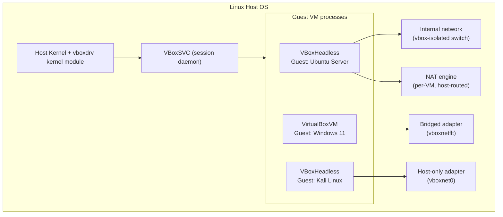

# Oracle VirtualBox

## Overview

Oracle VirtualBox is a free, cross-platform Type-2 (hosted) hypervisor that runs guest operating systems as user-space processes on top of a host OS such as a Debian/Ubuntu or RHEL/Fedora workstation. It is the workhorse hypervisor for home labs, CTF ranges, and pentest sandboxes because it is scriptable end-to-end through `VBoxManage`, supports fully isolated lab networks, and its snapshot model makes it trivial to roll a compromised VM back to a known-good state. For side-by-side comparison with a Type-2 competitor and for enterprise Type-1 deployment, see [VMware-Workstation-and-ESXi](VMware-Workstation-and-ESXi.md); for the general theory of point-in-time VM state, see [Snapshots-and-Cloning](Snapshots-and-Cloning.md).

> [!IMPORTANT]
> **Type-2 hypervisor caveat**
> VirtualBox runs *inside* the host OS and shares its kernel scheduling and I/O stack. It will always be slower and less isolated than a Type-1/bare-metal hypervisor (ESXi, KVM/Proxmox). Never use VirtualBox to "contain" genuinely hostile code (malware analysis, red-team payload detonation) without additional isolation — use a dedicated analysis host or a Type-1 hypervisor with strict host-only networking instead.

## Concepts

| Term | Meaning |
|---|---|
| **Guest** | The virtual machine and its OS running inside VirtualBox |
| **Host** | The physical machine running the VirtualBox hypervisor |
| **VDI/VMDK/VHD** | Virtual disk image formats VirtualBox can create or import (VDI is native, VMDK/VHD are for VMware/Hyper-V interop) |
| **Guest Additions** | A driver + service package installed inside the guest for better video, shared folders, clipboard, and time sync |
| **Extension Pack** | Oracle add-on providing USB 2.0/3.0 passthrough, PXE boot for Intel NICs, and disk encryption — **different license** than the base VirtualBox binaries |
| **Headless mode** | Runs a VM with no GUI window, controlled entirely via CLI/RDP — ideal for servers and lab hosts |
| **Snapshot** | A saved point-in-time state of a VM's disk (and optionally RAM) that can be restored later |

## Architecture



## Installation

### RHEL / Fedora / Rocky

```bash
# Enable Oracle's repo (or use the RPM Fusion mirror on Fedora)
sudo dnf install -y @development-tools kernel-devel kernel-headers dkms elfutils-libelf-devel
sudo dnf config-manager --add-repo https://download.virtualbox.org/virtualbox/rpm/rhel/virtualbox.repo
sudo dnf install -y VirtualBox-7.1

# Load the kernel module and add your user to the vboxusers group
sudo usermod -aG vboxusers "$USER"
sudo /sbin/vboxconfig
```

### Debian / Ubuntu

```bash
sudo apt update
sudo apt install -y build-essential dkms linux-headers-$(uname -r)

# Add Oracle's signed repo
wget -qO- https://www.virtualbox.org/download/oracle_vbox_2016.asc | sudo gpg --dearmor -o /usr/share/keyrings/oracle-virtualbox-2016.gpg
echo "deb [arch=amd64 signed-by=/usr/share/keyrings/oracle-virtualbox-2016.gpg] https://download.virtualbox.org/virtualbox/debian $(lsb_release -cs) contrib" \
  | sudo tee /etc/apt/sources.list.d/virtualbox.list

sudo apt update
sudo apt install -y virtualbox-7.1
sudo usermod -aG vboxusers "$USER"
```

> [!WARNING]
> **Secure Boot**
> On hosts with UEFI Secure Boot enabled, the `vboxdrv`, `vboxnetflt`, and `vboxnetadp` kernel modules must be signed (MOK enrollment via `mokutil --import`) or the modules will fail to load and VMs won't start. Either enroll a signing key during install or disable Secure Boot in firmware for lab hosts.

### Extension Pack

```bash
# Match the exact version to your installed VirtualBox release
wget https://download.virtualbox.org/virtualbox/7.1.6/Oracle_VirtualBox_Extension_Pack-7.1.6.vbox-extpack
sudo VBoxManage extpack install Oracle_VirtualBox_Extension_Pack-7.1.6.vbox-extpack
VBoxManage list extpacks
```

## Configuration

### Guest Additions

Installed *inside* the guest OS to unlock better graphics performance, shared clipboard, drag-and-drop, shared folders, and host/guest time sync.

```bash
# From the VirtualBox GUI: Devices → Insert Guest Additions CD image
# Or mount the ISO shipped with the install via CLI:
VBoxManage storageattach "Ubuntu-Lab" --storagectl "IDE" \
  --port 1 --device 0 --type dvddrive \
  --medium /usr/share/virtualbox/VBoxGuestAdditions.iso

# Inside a Debian/Ubuntu guest:
sudo apt install -y build-essential dkms linux-headers-$(uname -r)
sudo mount /dev/cdrom /mnt
sudo /mnt/VBoxLinuxAdditions.run
sudo reboot

# Inside an RHEL/Fedora guest:
sudo dnf install -y gcc kernel-devel kernel-headers dkms make bzip2
sudo mount /dev/cdrom /mnt
sudo /mnt/VBoxLinuxAdditions.run
```

### Networking modes

| Mode | Guest sees | Guest ↔ Host | Guest ↔ LAN | Guest ↔ Guest | Typical use |
|---|---|---|---|---|---|
| **NAT** | Private IP behind a virtual router (10.0.2.x) | Yes (via NAT) | Outbound only, no inbound without port-forward | No (unless same NAT network) | Quick internet access, single VM |
| **NAT Network** | Same as NAT but shared switch | Yes | Outbound only | Yes | Multi-VM lab needing internet + intra-VM chat |
| **Bridged** | Real IP on the physical LAN via the host NIC | Yes | Full, bidirectional | Yes | VM should look like a real host on the network |
| **Host-only** | Private IP on a host-only virtual adapter (`vboxnet0`) | Yes | No | Yes | Fully isolated lab (attacker/victim VMs, no internet leak) |
| **Internal Network** | Private IP on a switch that *excludes* the host | No | No | Yes | Strict isolation — host itself cannot reach the VM |

```bash
# NAT (default) — good enough for a single lab VM needing outbound internet
VBoxManage modifyvm "Kali-Attacker" --nic1 nat

# Host-only — attacker/victim pair fully isolated from the LAN and internet
VBoxManage hostonlyif create
VBoxManage hostonlyif ipconfig vboxnet0 --ip 192.168.56.1 --netmask 255.255.255.0
VBoxManage modifyvm "Kali-Attacker" --nic1 hostonly --hostonlyadapter1 vboxnet0
VBoxManage modifyvm "Metasploitable2" --nic1 hostonly --hostonlyadapter1 vboxnet0

# Bridged — VM gets a real DHCP lease on the physical LAN
VBoxManage list bridgedifs | grep ^Name
VBoxManage modifyvm "Ubuntu-Server" --nic1 bridged --bridgeadapter1 eth0

# Internal network — host itself cannot reach the VMs, only VMs can reach each other
VBoxManage modifyvm "Victim-A" --nic1 intnet --intnet1 "isolab"
VBoxManage modifyvm "Victim-B" --nic1 intnet --intnet1 "isolab"
```

> [!TIP]
> **Building an isolated pentest range**
> Combine **Host-only** (so your Kali box and the host can talk) with **Internal Network** for a segmented victim tier, or chain a pfSense/router VM between an Internal Network and a Bridged/NAT uplink to fully control routing and logging — mirroring how HTB/THM Pro Labs are built.

## Commands

`VBoxManage` (aliased `vboxmanage` on some distros) is the full CLI control surface — everything the GUI does is a wrapper around it.

```bash
# Inventory
VBoxManage list vms                      # all registered VMs
VBoxManage list runningvms                # currently running
VBoxManage showvminfo "Kali-Attacker"     # full config dump

# Create a VM from scratch
VBoxManage createvm --name "Debian-Server" --ostype Debian_64 --register
VBoxManage modifyvm "Debian-Server" --memory 2048 --cpus 2 --nic1 nat --vram 16
VBoxManage createhd --filename ~/VirtualBox\ VMs/Debian-Server/disk1.vdi --size 20480
VBoxManage storagectl "Debian-Server" --name "SATA" --add sata --controller IntelAhci
VBoxManage storageattach "Debian-Server" --storagectl "SATA" --port 0 --device 0 \
  --type hdd --medium ~/VirtualBox\ VMs/Debian-Server/disk1.vdi
VBoxManage storagectl "Debian-Server" --name "IDE" --add ide
VBoxManage storageattach "Debian-Server" --storagectl "IDE" --port 0 --device 0 \
  --type dvddrive --medium ~/ISOs/debian-13-netinst.iso
VBoxManage modifyvm "Debian-Server" --boot1 dvd --boot2 disk

# Power control
VBoxManage startvm "Debian-Server" --type headless
VBoxManage controlvm "Debian-Server" acpipowerbutton   # graceful shutdown
VBoxManage controlvm "Debian-Server" poweroff          # hard stop
VBoxManage controlvm "Debian-Server" pause
VBoxManage controlvm "Debian-Server" resume

# Snapshots
VBoxManage snapshot "Debian-Server" take "clean-install" --description "Fresh OS, no updates"
VBoxManage snapshot "Debian-Server" list
VBoxManage snapshot "Debian-Server" restore "clean-install"
VBoxManage snapshot "Debian-Server" delete "clean-install"

# Cloning
VBoxManage clonevm "Debian-Server" --name "Debian-Server-Clone" --register --mode all
```

## Examples

### Headless VM with SSH-only access

```bash
# Start with no GUI at all — ideal for a lab/CI host with no desktop
VBoxManage startvm "Debian-Server" --type headless

# Forward host port 2222 to guest port 22 over NAT
VBoxManage modifyvm "Debian-Server" --natpf1 "ssh,tcp,,2222,,22"
ssh -p 2222 admin@127.0.0.1

# Stop the VM cleanly from a script/cron job
VBoxManage controlvm "Debian-Server" acpipowerbutton
```

### Scripted attacker/victim lab reset (snapshot rollback)

```bash
#!/usr/bin/env bash
# reset-lab.sh — revert both VMs to a clean baseline before each exercise
set -euo pipefail
for vm in "Kali-Attacker" "Metasploitable2"; do
  VBoxManage controlvm "$vm" poweroff || true
  sleep 2
  VBoxManage snapshot "$vm" restore "baseline"
  VBoxManage startvm "$vm" --type headless
done
```

### Shared folder for exfil/tooling transfer

```bash
VBoxManage sharedfolder add "Kali-Attacker" --name "tools" \
  --hostpath /d-data/Notes/lab-tools --automount
```

## Best Practices

- **Name VMs and snapshots descriptively** (`baseline`, `pre-exploit`, `post-compromise`) — `VBoxManage snapshot list` output is your only audit trail.
- **Take a `baseline` snapshot immediately after Guest Additions install and OS hardening**, before any lab exercise, so every run starts identical.
- **Use headless mode + `VBoxManage`/cron for lab automation** rather than clicking through the GUI — it is repeatable and scriptable in CI.
- **Pin `VBoxManage modifyvm --nic1`** explicitly in scripts rather than relying on GUI defaults; NAT is the VirtualBox default and silently leaks less than you'd expect but still permits outbound internet.
- **Store VM disk images (`.vdi`) on fast local storage** (NVMe/SSD), not network shares — I/O latency dominates guest performance.
- Keep the **Extension Pack version pinned to the exact VirtualBox release** — mismatches cause `VBoxManage extpack install` failures and USB passthrough breakage after upgrades.

## Security Considerations

- **Extension Pack licensing**: the Extension Pack is PUEL-licensed (free for personal/evaluation use only) — do not deploy it in a commercial environment without a license, and audit for it during compliance reviews (CIS General guidance on unlicensed software).
- **Host-only/Internal networks are your primary containment control** for anything resembling a malicious payload, ransomware sample, or untrusted binary — never bridge or NAT such a VM to a network with production assets.
- **Disable clipboard and drag-and-drop sharing** (`VBoxManage modifyvm <vm> --clipboard-mode disabled --draganddrop disabled`) on VMs handling malware or credentials, to prevent accidental host contamination.
- **3D acceleration and USB passthrough increase host attack surface** — CVEs have been found in the VirtualBox graphics and USB emulation stack allowing guest-to-host escape. Disable `--accelerate-3d off` and avoid Extension Pack USB passthrough on any VM analyzing untrusted code.
- **Encrypt VM disk images at rest** for lab VMs holding client data or captured credentials: `VBoxManage encryptmedium <uuid> --newpassword <file> --cipher "AES-XTS256-PLAIN64"`.
- **Patch VirtualBox promptly** — it is regularly listed in Oracle's Critical Patch Update advisories; an outdated hypervisor is a viable guest-escape vector in a pentest lab that shares a host with production tooling.
- Treat `vboxusers` group membership as privileged: members can attach raw disks and USB devices to VMs, which is effectively host-level device access.

## Troubleshooting

| Symptom | Likely Cause | Fix |
|---|---|---|
| `VBoxManage: error: Kernel driver not installed` | `vboxdrv` module not loaded / Secure Boot blocking it | `sudo /sbin/vboxconfig` (RHEL) or `sudo /sbin/rcvboxdrv setup`; enroll MOK key if Secure Boot is on |
| VM won't start, "raw-mode support removed" | Old VM config from VirtualBox < 6.1 needs VT-x/AMD-V | Enable virtualization extensions in host BIOS/UEFI; run `egrep -c '(vmx|svm)' /proc/cpuinfo` to confirm |
| No internet in guest (NAT mode) | Host firewall blocking `vboxnet` interfaces | Check `iptables`/`nft`/`firewalld` zones covering `vboxnet*`; on `firewalld`, add the interface to the `trusted` zone for lab hosts only |
| Guest Additions install fails: "missing kernel headers" | Guest kernel updated without matching `-headers`/`-devel` package | Reinstall matching headers, then re-run `VBoxLinuxAdditions.run` |
| Bridged networking has no link | Wrong host NIC selected, or host NIC is Wi-Fi (bridging Wi-Fi is unreliable on Linux) | Use `VBoxManage list bridgedifs`, prefer wired `eth0`; fall back to NAT Network for Wi-Fi hosts |
| Snapshot restore hangs or VM state corrupt | Snapshot taken while VM was saving state / disk I/O in flight | Always `poweroff` or cleanly shut down before `snapshot take`; avoid snapshotting a VM mid-write to its disk |
| `VERR_SUPLIB_WORLD_WRITABLE` on VM start | `/etc/vbox` or module perms too permissive after manual edits | Reset permissions per package defaults; reinstall the DKMS package |

> [!NOTE]
> **📸 Screenshot**
> _Capture the VirtualBox Manager's **Network** settings tab for a VM, showing the Adapter dropdown with NAT / Bridged / Host-only / Internal options selected, to illustrate the networking-mode comparison table above._

## References

- Oracle VirtualBox User Manual — https://www.virtualbox.org/manual/
- `VBoxManage` command reference — https://www.virtualbox.org/manual/ch08.html
- VirtualBox Networking chapter — https://www.virtualbox.org/manual/ch06.html
- VirtualBox Extension Pack licensing (PUEL) — https://www.virtualbox.org/wiki/VirtualBox_PUEL
- `man VBoxManage`
- CIS Benchmarks — Virtualization/Hypervisor hardening guidance — https://www.cisecurity.org/cis-benchmarks

## Related Notes

- [VMware-Workstation-and-ESXi](VMware-Workstation-and-ESXi.md) — Type-2 vs Type-1 hypervisor comparison and ESXi deployment
- [Snapshots-and-Cloning](Snapshots-and-Cloning.md) — general theory and cross-hypervisor practice for VM state management
- [Linux Administration & Server Hardening](../Readme.md) — course hub and map of content
