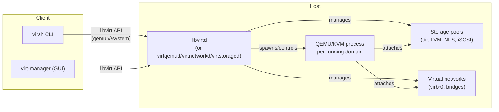

# libvirt and virsh

## Overview

libvirt is the toolkit and daemon-based API that most Linux hypervisor stacks (KVM/QEMU, Xen, LXC) sit behind, giving a single stable interface for defining, starting, and inspecting virtual machines regardless of the underlying hypervisor. Everything libvirt manages — domains (VMs), storage pools, and virtual networks — is described declaratively in XML, and the `virsh` CLI is the day-to-day tool for reading and mutating that state. [virt-manager](virt-manager.md) is the GUI front end built on the same libvirt API, and [Virtual-Networking-in-libvirt](Virtual-Networking-in-libvirt.md) covers the NAT/bridge networking model referenced here only in passing.

> [!IMPORTANT]
> libvirt is a management layer, not a hypervisor. `libvirtd` (or the modularized per-driver daemons on newer distros) talks to QEMU/KVM underneath; killing `libvirtd` does **not** stop running VMs, but you lose the ability to manage them until it restarts.

## Concepts

| Term | Meaning |
|---|---|
| **Domain** | A virtual machine, in libvirt terminology. Defined by an XML document. |
| **Driver** | The hypervisor backend libvirt talks to: `qemu`, `xen`, `lxc`, `bhyve`. |
| **Connection URI** | Identifies which libvirt driver/instance to talk to, e.g. `qemu:///system`. |
| **Storage pool** | A managed source of storage (dir, LVM VG, iSCSI target, NFS share) that carves out **volumes** for domain disks. |
| **Network** | A libvirt-managed virtual network (NAT, routed, or bridged) that domains attach NICs to. |
| **Transient vs. persistent** | A transient domain/network exists only in memory (`virsh create`); a persistent one has an XML definition on disk (`virsh define`) and survives host reboots. |

## Architecture



Modern distros (RHEL 9+, Fedora, recent Debian/Ubuntu) split the monolithic `libvirtd` into modular per-driver socket-activated daemons — `virtqemud`, `virtnetworkd`, `virtstoraged`, `virtinterfaced`, `virtnodedevd`, `virtsecretd`, `virtnwfilterd` — for smaller attack surface and faster restarts. The `virsh` CLI and connection URIs behave identically either way.

## Installation

**RHEL/Fedora/CentOS Stream:**

```bash
sudo dnf install @virtualization
# or minimal:
sudo dnf install libvirt qemu-kvm virt-install virt-manager
sudo systemctl enable --now libvirtd
# on modular builds instead:
sudo systemctl enable --now virtqemud virtnetworkd virtstoraged
```

**Debian/Ubuntu:**

```bash
sudo apt update
sudo apt install qemu-kvm libvirt-daemon-system libvirt-clients virtinst bridge-utils
sudo systemctl enable --now libvirtd
```

Add your admin user to the `libvirt` group (Debian) or `libvirt`/`libvirtd` group (RHEL) so `virsh` works without `sudo` over the default socket:

```bash
sudo usermod -aG libvirt "$USER"
newgrp libvirt
```

Verify hardware virtualization support before installing:

```bash
grep -Eo '(vmx|svm)' /proc/cpuinfo | sort -u   # vmx = Intel VT-x, svm = AMD-V
sudo virt-host-validate
```

## Configuration

libvirt's own config lives in `/etc/libvirt/`:

```text
/etc/libvirt/libvirtd.conf     # daemon-wide: sockets, auth, logging
/etc/libvirt/qemu.conf         # QEMU driver: user/group, cgroup, security driver
/etc/libvirt/qemu/*.xml        # persistent domain definitions (do not hand-edit; use virsh edit)
/etc/libvirt/storage/*.xml     # persistent storage pool definitions
/etc/libvirt/qemu/networks/*.xml  # persistent network definitions
```

Key `qemu.conf` hardening knobs:

```conf
# /etc/libvirt/qemu.conf
security_driver = "selinux"     # or "apparmor" on Debian/Ubuntu
user = "qemu"                   # RHEL default; Debian uses "libvirt-qemu"
group = "qemu"
dynamic_ownership = 1           # auto-fix disk image perms/labels per VM
```

A minimal domain XML skeleton (what `virsh define`/`virsh edit` operate on):

```xml
<domain type='kvm'>
  <name>web01</name>
  <memory unit='GiB'>4</memory>
  <vcpu placement='static'>2</vcpu>
  <os>
    <type arch='x86_64' machine='q35'>hvm</type>
    <boot dev='hd'/>
  </os>
  <features><acpi/><apic/></features>
  <devices>
    <disk type='file' device='disk'>
      <driver name='qemu' type='qcow2'/>
      <source file='/var/lib/libvirt/images/web01.qcow2'/>
      <target dev='vda' bus='virtio'/>
    </disk>
    <interface type='network'>
      <source network='default'/>
      <model type='virtio'/>
    </interface>
    <console type='pty'><target type='serial' port='0'/></console>
    <graphics type='vnc' port='-1' listen='127.0.0.1'/>
  </devices>
</domain>
```

## Commands

`virsh` is invoked as `virsh [-c URI] <command> [args]`. The default URI (`qemu:///system` for host-wide libvirtd, `qemu:///session` for a per-user unprivileged instance) is resolved from `$LIBVIRT_DEFAULT_URI` or `/etc/libvirt/libvirt.conf` if not given explicitly.

| Command | Purpose |
|---|---|
| `virsh list --all` | List domains (running + defined-but-stopped) |
| `virsh start <dom>` | Boot a defined (persistent) domain |
| `virsh create <file.xml>` | Start a **transient** domain directly from XML |
| `virsh shutdown <dom>` | Graceful ACPI shutdown (needs guest agent/ACPI support) |
| `virsh destroy <dom>` | Hard power-off (like pulling the plug) |
| `virsh reboot <dom>` | Graceful reboot |
| `virsh define <file.xml>` | Register a persistent domain from XML without starting it |
| `virsh undefine <dom>` | Remove the persistent definition (add `--remove-all-storage` to also delete disks) |
| `virsh edit <dom>` | Open the live domain XML in `$EDITOR`, validates on save |
| `virsh dumpxml <dom>` | Print the current domain XML (add `--inactive` for the on-disk definition) |
| `virsh console <dom>` | Attach to the serial console (requires a `<console>` device in the XML) |
| `virsh autostart <dom>` | Mark domain to start on host boot |
| `virsh domiflist <dom>` | Show a domain's virtual NICs |
| `virsh vol-list <pool>` | List volumes in a storage pool |
| `virsh pool-list --all` | List storage pools |
| `virsh net-list --all` | List virtual networks |

Connection URI examples:

```bash
virsh -c qemu:///system list --all       # host-wide, privileged, talks to root libvirtd
virsh -c qemu:///session list --all      # per-user, unprivileged, own QEMU processes
virsh -c qemu+ssh://admin@10.0.0.5/system list --all   # remote management over SSH
```

## Examples

Create a VM from an existing qcow2 disk and start it:

```bash
sudo qemu-img create -f qcow2 /var/lib/libvirt/images/web01.qcow2 20G

sudo virt-install \
  --name web01 \
  --memory 4096 \
  --vcpus 2 \
  --disk path=/var/lib/libvirt/images/web01.qcow2,format=qcow2,bus=virtio \
  --network network=default,model=virtio \
  --graphics vnc,listen=127.0.0.1 \
  --os-variant rhel9.0 \
  --cdrom /var/lib/libvirt/images/rhel9.iso
```

Inspect, edit, and reapply a domain's XML:

```bash
virsh dumpxml web01 > web01.xml          # export current definition
virsh edit web01                         # opens in $EDITOR, validates & applies on save
virsh define web01.xml                   # re-import an externally edited file
```

Attach to a text console (guest needs a serial getty enabled, e.g. `systemctl enable serial-getty@ttyS0`):

```bash
virsh console web01
# Ctrl+] to detach
```

Define a directory-backed storage pool and a volume in it:

```bash
virsh pool-define-as vmdata dir --target /data/vms
virsh pool-build vmdata
virsh pool-start vmdata
virsh pool-autostart vmdata
virsh vol-create-as vmdata web02.qcow2 20G --format qcow2
```

Snapshot a running domain before a risky change:

```bash
virsh snapshot-create-as web01 pre-patch --description "before kernel update"
virsh snapshot-list web01
virsh snapshot-revert web01 pre-patch
```

## Best Practices

- Use `virsh edit` (or `dumpxml` → edit → `define`), never hand-edit `/etc/libvirt/qemu/*.xml` in place — libvirt validates and reformats XML on save, and out-of-band edits can be silently overwritten.
- Prefer `virt-install` or Ansible's `community.libvirt` modules for repeatable VM creation over one-off `virsh define` of hand-written XML.
- Use `virtio` disk/NIC models for performance; fall back to `ide`/`e1000` only for guests without virtio drivers.
- Keep storage pools and networks **defined + autostart** (`virsh pool-autostart`, `virsh net-autostart`) so they come back after a host reboot.
- Snapshot before patching or upgrading a guest kernel; `qcow2` internal snapshots are fast but are not a substitute for real backups.
- For remote management, use `qemu+ssh://` URIs with key-based auth rather than exposing the libvirt TCP/TLS listener unless you've deliberately set up TLS + x509 client certs.

## Security Considerations

- **Least privilege for QEMU processes**: keep `qemu.conf`'s `user`/`group` set to an unprivileged account (`qemu` on RHEL, `libvirt-qemu` on Debian), never `root`. This aligns with CIS's general "run services as non-root" guidance.
- **Mandatory access control**: keep `security_driver = "selinux"` (RHEL) or AppArmor (Debian/Ubuntu) enabled — `sVirt` confines each QEMU process so a guest escape can't read another guest's disk image or the host filesystem.
- **libvirt group membership is root-equivalent** under `qemu:///system` — anyone in the `libvirt` group can define a domain with a raw disk pointing at `/dev/sda` or a hostdev passthrough, effectively giving them host root. Audit `getent group libvirt` regularly.
- **Disable the legacy TCP listener**: `listen_tcp = 0` in `libvirtd.conf` (the default) unless remote non-SSH access is explicitly required; if you must expose it, require `listen_tls = 1` with client certificate verification, never `auth_tcp = "none"`.
- **VNC/SPICE consoles**: bind graphics devices to `127.0.0.1` (as shown above) and tunnel over SSH rather than binding `0.0.0.0` with no password.
- **Firewall the network bridges appropriately** — `virbr0` NAT traffic is handled by libvirt's own nftables/iptables rules; don't disable `firewalld`/`ufw` wholesale just because libvirt manages some rules itself.

```bash
# RHEL-family: confirm firewalld is still active alongside libvirt's own rules
sudo firewall-cmd --state
sudo firewall-cmd --list-all

# Debian-family: confirm ufw status
sudo ufw status verbose
```

> [!WARNING]
> Never set `security_driver = "none"` in `qemu.conf` to "fix" a permission error — it disables sVirt confinement for every guest on the host. Fix the underlying label/ownership mismatch instead (`restorecon`, `virt-sanlock-cleanup`, or `dynamic_ownership = 1`).

> [!NOTE]
> **📸 Screenshot**
> _Capture: `virsh list --all` output showing a mix of running/shut-off domains, alongside `virsh dumpxml <dom> | head -30` in a split terminal to illustrate the CLI-to-XML relationship._

## Troubleshooting

| Symptom | Likely cause | Fix |
|---|---|---|
| `virsh: command not found` | Client package missing | Install `libvirt-clients` (Debian) / `libvirt-client` (RHEL) |
| `error: failed to connect to the hypervisor` | `libvirtd`/modular daemons not running, or wrong URI | `systemctl status libvirtd`; check `$LIBVIRT_DEFAULT_URI` |
| `Permission denied` connecting to `qemu:///system` | User not in `libvirt` group | `usermod -aG libvirt $USER`, then re-login/`newgrp` |
| VM won't start: `Could not access KVM kernel module` | Nested virt disabled, or CPU lacks VT-x/AMD-V exposed to host | `virt-host-validate`; enable virtualization in host BIOS/hypervisor |
| Disk image permission errors on start | SELinux/AppArmor label mismatch or ownership drift | `restorecon -Rv /var/lib/libvirt/images`; ensure `dynamic_ownership=1` |
| `virsh console` shows nothing | No serial console configured in guest | Add `<console>` device in XML; enable `serial-getty@ttyS0` in guest |
| Network changes not applying to a running domain | Network device attached at boot, live update needs hot-plug or restart | `virsh detach-interface` / `attach-interface --live`, or reboot the domain |
| `libvirtd.service` fails after modular daemon migration | Both `libvirtd.socket` and `virtqemud.socket` active/conflicting | Pick one model consistently; see distro release notes for migration steps |

## References

- libvirt official documentation — https://libvirt.org/docs.html
- libvirt domain XML format — https://libvirt.org/formatdomain.html
- `man virsh`, `man libvirtd`, `man qemu.conf`
- Red Hat Documentation — Configuring and Managing Virtualization (RHEL 9)
- CIS Benchmarks — relevant hypervisor/host hardening sections under the applicable CIS Linux Benchmark

## Related Notes

- [virt-manager](virt-manager.md)
- [Virtual-Networking-in-libvirt](Virtual-Networking-in-libvirt.md)
- [Linux Administration & Server Hardening](../Readme.md) — course hub and map of content
