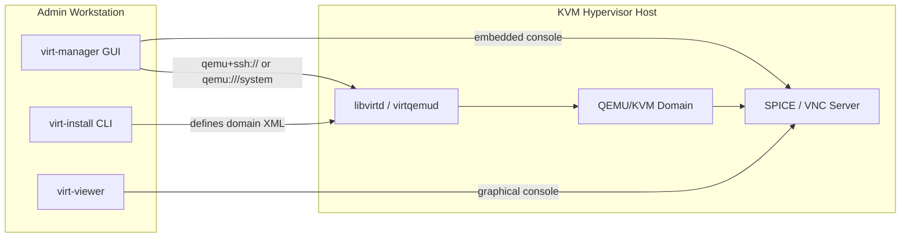

# virt-manager and virt-install

## Overview

`virt-manager` is a GTK desktop application that gives a graphical console to a libvirt-managed hypervisor, while `virt-install` is its command-line counterpart for scripted, repeatable VM creation. Both sit on top of the same [libvirt](libvirt-and-virsh.md) daemon and XML domain model, so a VM created with one tool is fully visible and editable in the other. For unattended, cloud-image-based provisioning that skips the installer entirely, pair `virt-install` with [cloud-init](Cloud-init-and-VM-Templates.md) seed images instead of an ISO.

> [!IMPORTANT]
> `virt-manager` and `virt-install` are **management-plane tools** — they talk to `libvirtd` (locally or remotely) to define, start, and configure domains. They do not replace `virsh` for day-2 operations; most admins use `virt-install` to create a VM once, then manage it long-term with `virsh` or `virt-manager`'s GUI.

## Concepts

| Component | Role |
|---|---|
| `virt-manager` | GTK GUI: create/edit/delete VMs, live console (SPICE/VNC), graphs of CPU/disk/net, snapshot management, storage/network pool editors |
| `virt-install` | CLI tool that generates a libvirt domain XML and calls the installer (or boots a cloud image) — ideal for scripts and CI |
| `virt-viewer` | Lightweight standalone SPICE/VNC console client — no VM management UI, just the display |
| `libvirtd` / `virtqemud` | Backend daemon both tools talk to via the libvirt API (local socket or remote URI) |
| Connection URI | `qemu:///system` (root-owned system VMs), `qemu:///session` (unprivileged per-user VMs), `qemu+ssh://user@host/system` (remote over SSH) |

## Architecture



## Installation

**RHEL / Fedora / Rocky (dnf):**

```bash
sudo dnf install -y virt-manager virt-install virt-viewer libvirt qemu-kvm bridge-utils
sudo systemctl enable --now libvirtd
sudo usermod -aG libvirt $(whoami)
```

**Debian / Ubuntu (apt):**

```bash
sudo apt update
sudo apt install -y virt-manager virtinst virt-viewer libvirt-daemon-system qemu-kvm bridge-utils
sudo systemctl enable --now libvirtd
sudo adduser $(whoami) libvirt
sudo adduser $(whoami) kvm
```

> [!NOTE]
> Log out and back in (or `newgrp libvirt`) after group changes — group membership is read at login, not applied retroactively to the current shell.

## Configuration

### Remote libvirt over SSH

Rather than opening libvirt's TCP/TLS listener, the standard approach is tunneling the libvirt RPC protocol over SSH — no extra ports, reuses existing SSH key auth.

1. Ensure key-based SSH auth works from client to host:

```bash
ssh-copy-id admin@kvm-host.example.com
ssh admin@kvm-host.example.com 'virsh --connect qemu:///system list --all'
```

2. Add the remote connection in `virt-manager`: **File → Add Connection → Hypervisor: QEMU/KVM → Connect to remote host over SSH → username + hostname**. Equivalently, from the CLI:

```bash
virt-manager --connect qemu+ssh://admin@kvm-host.example.com/system
```

3. Or set it as the default URI for `virsh`/`virt-install` in the current shell:

```conf
# ~/.config/libvirt/libvirt.conf
uri_default = "qemu+ssh://admin@kvm-host.example.com/system"
```

### Storage and network pools (GUI)

In `virt-manager`, per-connection **Edit → Connection Details → Storage** and **Network** tabs manage pools (`default` dir-backed pool at `/var/lib/libvirt/images`) and virtual networks (default NAT `virbr0`). These are the same objects `virsh pool-list` / `virsh net-list` show — see [libvirt-and-virsh](libvirt-and-virsh.md) for the CLI equivalents.

## Commands

| Task | Command |
|---|---|
| Launch GUI | `virt-manager` |
| Launch GUI to a specific host | `virt-manager --connect qemu+ssh://user@host/system` |
| Open console only, no manager UI | `virt-viewer --connect qemu:///system <vm-name>` |
| Open remote console over SSH | `virt-viewer --connect qemu+ssh://user@host/system <vm-name>` |
| List installable OS variants | `osinfo-query os` |
| Dry-run domain XML without creating | `virt-install ... --print-xml` |
| Create VM from ISO, don't autostart console | `virt-install ... --noautoconsole` |

## Examples

### Interactive install from ISO

```bash
virt-install \
  --name web01 \
  --memory 4096 \
  --vcpus 2 \
  --disk size=40,pool=default,format=qcow2 \
  --cdrom /var/lib/libvirt/images/rhel-9.iso \
  --os-variant rhel9.4 \
  --network network=default,model=virtio \
  --graphics spice \
  --noautoconsole
```

Attach a console afterward with `virt-viewer web01` or from `virt-manager`'s VM list.

### Unattended install with a kickstart/preseed file

```bash
virt-install \
  --name db01 \
  --memory 8192 --vcpus 4 \
  --disk size=80,format=qcow2 \
  --location /var/lib/libvirt/images/rhel-9.iso \
  --os-variant rhel9.4 \
  --initrd-inject=/root/ks.cfg \
  --extra-args "inst.ks=file:/ks.cfg console=ttyS0" \
  --network bridge=br0,model=virtio \
  --graphics none \
  --console pty,target_type=serial
```

### Import an existing qcow2 disk (no installer)

```bash
virt-install \
  --name imported-vm \
  --memory 2048 --vcpus 2 \
  --disk /var/lib/libvirt/images/imported-vm.qcow2,format=qcow2 \
  --import \
  --os-variant detect=on,require=off \
  --network network=default \
  --graphics spice \
  --noautoconsole
```

### Cloud-init-driven provisioning

```bash
virt-install \
  --name cloud-vm01 \
  --memory 2048 --vcpus 2 \
  --disk /var/lib/libvirt/images/cloud-vm01.qcow2,size=20,backing_store=/var/lib/libvirt/images/ubuntu-24.04-base.qcow2 \
  --disk /var/lib/libvirt/images/cloud-vm01-seed.iso,device=cdrom \
  --os-variant ubuntu24.04 \
  --network network=default,model=virtio \
  --graphics none \
  --import \
  --noautoconsole
```

Generate the `cloud-vm01-seed.iso` with `cloud-localds` from a `user-data`/`meta-data` pair — see [Cloud-init-and-VM-Templates](Cloud-init-and-VM-Templates.md) for the full templating workflow.

> [!NOTE]
> **📸 Screenshot**
> _Capture: virt-manager's "New VM" wizard step showing memory/CPU allocation, alongside the equivalent `virt-install` command in a terminal, to illustrate that GUI and CLI produce the same domain XML._

## Best Practices

- Always pass a correct `--os-variant` (`osinfo-query os` to list them) — it tunes QEMU defaults (clock source, disk bus, virtio drivers) for that guest OS.
- Prefer `virtio` disk/network models (`--disk bus=virtio`, `--network model=virtio`) over emulated IDE/e1000 for near-native performance.
- Use `--print-xml` to review generated XML before committing, especially for scripted/CI pipelines.
- Keep golden/base qcow2 images read-only and use `backing_store` (copy-on-write) for per-VM disks to save space and speed up provisioning.
- For headless hosts, always pass `--graphics none --console pty,target_type=serial` and configure a serial console in the guest kernel args, so you have a console without SPICE/VNC.
- Script `virt-install` invocations in version control for reproducible lab/CI environments rather than clicking through the GUI each time.

## Security Considerations

- Use `qemu:///session` (unprivileged, per-user) for developer/test VMs where root-level `qemu:///system` access is unnecessary — reduces blast radius (CIS-aligned least privilege).
- For remote access, prefer `qemu+ssh://` over libvirt's native TLS/TCP listener (`qemu+tls://`) unless you already run a PKI; SSH reuses existing key-based auth and requires no additional exposed port.
- Never enable the unencrypted `qemu+tcp://` transport in production — it authenticates and transmits management traffic in clear text.
- Restrict membership in the `libvirt` group; it is effectively equivalent to root on the hypervisor host via `qemu:///system` (VMs can mount host paths, attach arbitrary block devices).
- Set SPICE/VNC console passwords (`--graphics spice,password=...`) or bind consoles to `127.0.0.1`/a management-only interface — an unauthenticated VNC listener on a routable interface exposes the guest console to anyone on that network.
- Enable SELinux (RHEL) `sVirt` or AppArmor (Debian/Ubuntu) libvirt confinement — both ship enabled by default and sandbox each QEMU process from others and from the host.

## Troubleshooting

| Symptom | Cause / Fix |
|---|---|
| "Unable to connect to libvirt" in virt-manager | `libvirtd`/`virtqemud` not running: `sudo systemctl status libvirtd`; or user not in `libvirt` group |
| `virt-install` hangs at "Starting install..." | Console launch failed — retry with `--noautoconsole` then `virt-viewer <name>` separately |
| SSH remote connection prompts for password repeatedly | SSH key not loaded in agent, or `~/.ssh/config` missing `Host` alias — test with plain `ssh` first |
| PXE/network install can't reach network | Default NAT network `virbr0` not started — `virsh net-start default; virsh net-autostart default` |
| Console shows black screen over SPICE | Guest video driver mismatch — use `--video qxl` (Linux) or `--video virtio` on recent QEMU |
| "Permission denied" on disk image | SELinux context wrong — `restorecon -Rv /var/lib/libvirt/images` or check `virt-manager` storage pool permissions |

## References

- Red Hat Documentation — [Configuring and managing virtualization](https://docs.redhat.com/en/documentation/red_hat_enterprise_linux/9/html/configuring_and_managing_virtualization/)
- `man virt-install`, `man virt-manager`, `man virt-viewer`
- libvirt project — [Connection URIs](https://libvirt.org/uri.html)
- Ubuntu Server Documentation — [Virtualization with QEMU](https://ubuntu.com/server/docs/virtualization-qemu)
- CIS Benchmarks — Distribution Independent Linux Benchmark, Virtualization section

## Related Notes

- [libvirt-and-virsh](libvirt-and-virsh.md) — the underlying daemon and CLI both tools drive
- [Cloud-init-and-VM-Templates](Cloud-init-and-VM-Templates.md) — unattended provisioning workflow for `virt-install --import`
- [Linux Administration & Server Hardening](../Readme.md) — course hub and map of content
